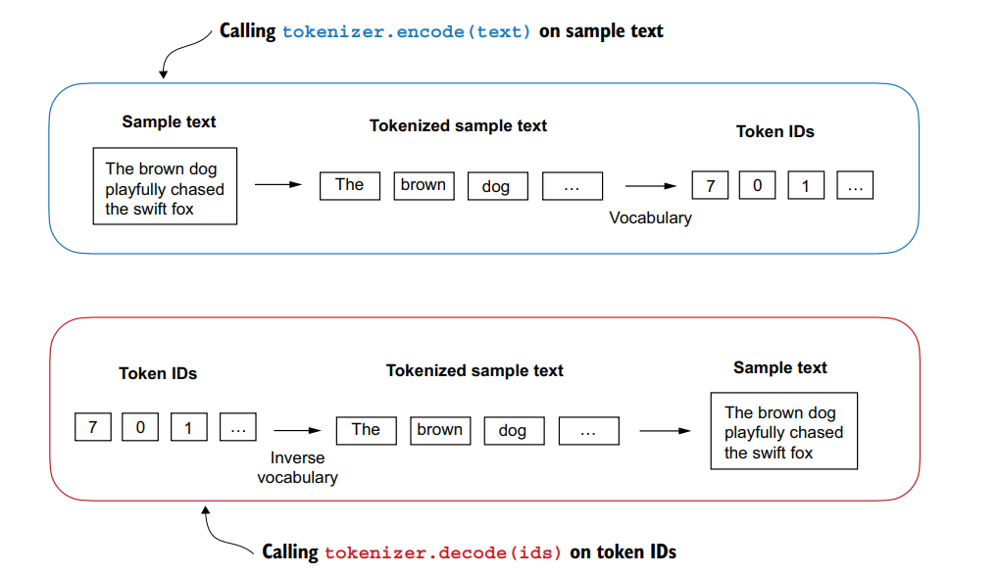
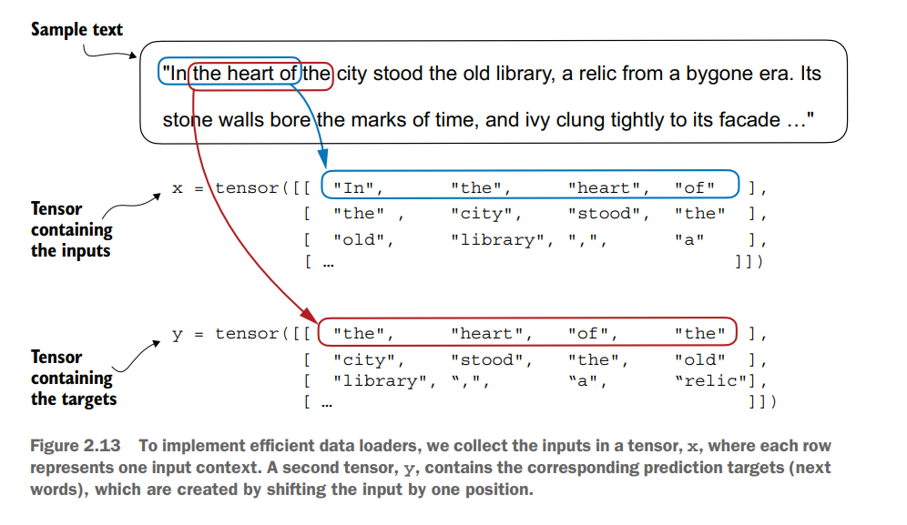

### 1. tokenize.py
contains tokenize class with two methods:
* encode -  Takes in text and returns list of token ids
* decode - Takes in list of token ids and returns text 

    

implement tiktoken's .encode() and .decode()

### 2. dataset.py
create the input - output pairs for the llm to train on

* Inherits pytorch Dataset class
* uses a pytorch Dataloader

### 3. embed.py
performs embedding

* token embedding - embeds based on vocab size (vocab size x embed output dim)
* position embedding - embeds based on context length (context length x embed output dim)